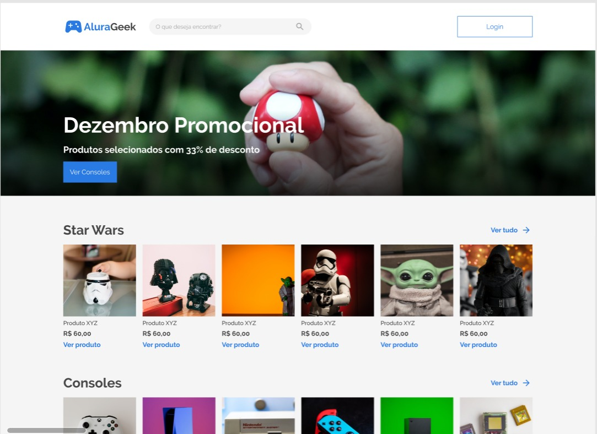

# Alura-Geek-e-commerce
E-Commerce

  

 
<h1 align="center"> 
    
</h1>

A empresa AluraGeek está precisando trazer mais clientes e aumentar suas vendas, para isso desejam implementar um e-commerce e levar a empresa ao próximo patamar, se tornar mais digital.

Para isso eles estão solicitando a nossa ajuda como desenvolvedores para criar o site e o e-commerce deve conter os seguintes requisitos:
- Uma página inicial que contenha um botão "iniciar sessão" e um buscador de produtos oferecidos pela empresa.
- Um banner que contenha descontos, promoções, ou informações relevantes do momento.
- Uma galeria com as informações dos produtos como: a imagem, o nome do produto, o preço e um link que leva até a página de descrição do produto.
- Uma página do produto que contenha a imagem, o nome, a descrição e o preço.
- Um rodapé com formulário para contato e outras informações relevantes.
- Menu administrador para eles conseguirem adicionar, editar, buscar ou eliminar produtos da loja.
É muito importante que o site seja responsivo para dar aos clientes a facilidade de comprar através de dispositivos mobiles.

    

🚀 Tecnologias utilizadas

✔️ HTML5 
  

✔️ CSS3 
  

  
  Feito por Luciano Lima Jr.
